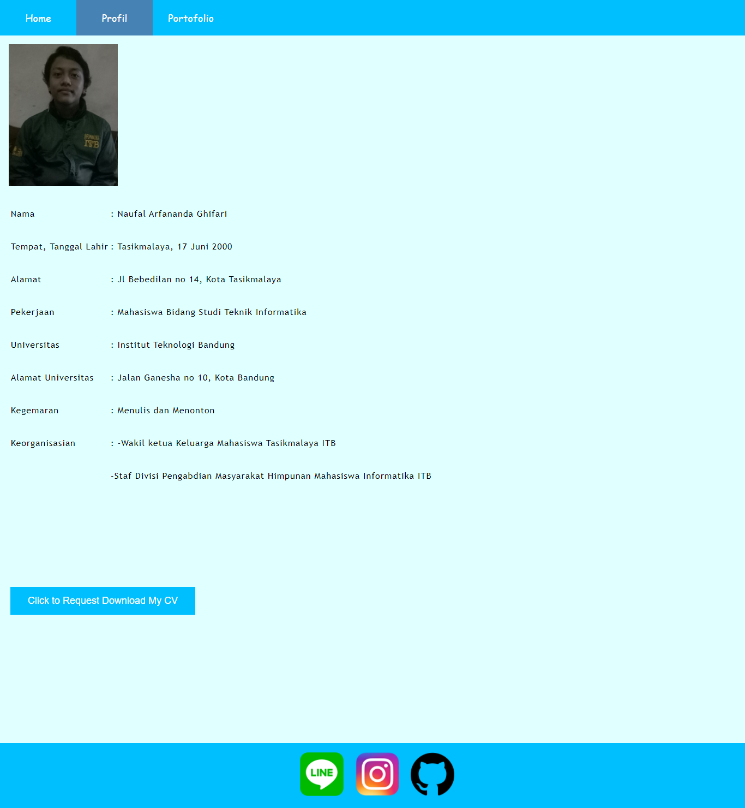

# Web-profil
Merupakan sebuah website sederhana yang isinya berupa profil biodata, foto, dan akun media sosial dari pembuat profil. Tersedia juga tombol yang membuat pembaca dapat me-*request* untuk mengunduh CV pembuat profil.
# Petunjuk Penggunaan
Buka file **profil.html** untuk menampilkan Web-profil yang sudah dibuat
# Dibuat oleh
## Naufal Arfananda Ghifari
13518096 - IF ITB
# Tujuan pembuatan
Dalam rangka pemenuhan :
## Tugas 1 IF3110 Pengembangan Aplikasi Berbasis Web
## Rincian Tugas
Pelajari bahasa HTML, CSS, dan Javascript dasar.
Buat satu halaman web dengan menggunakan HTML, CSS dan JavaScript sederhana yang menampilkan informasi tentang diri Anda
## Sumber pembelajaran yang digunakan 
*Courses* dari w3school dan sololearn, youtube video, serta forum tanya jawab stackoverflow
# Screenshot laman

# *Last Update*
31 Agustus 2020 